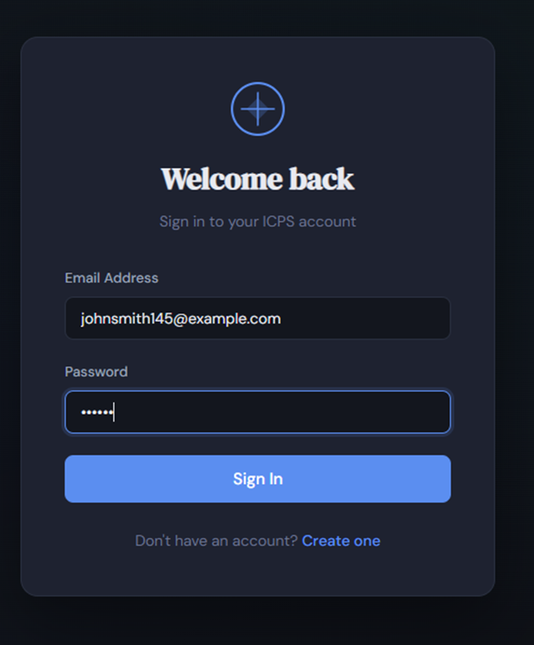
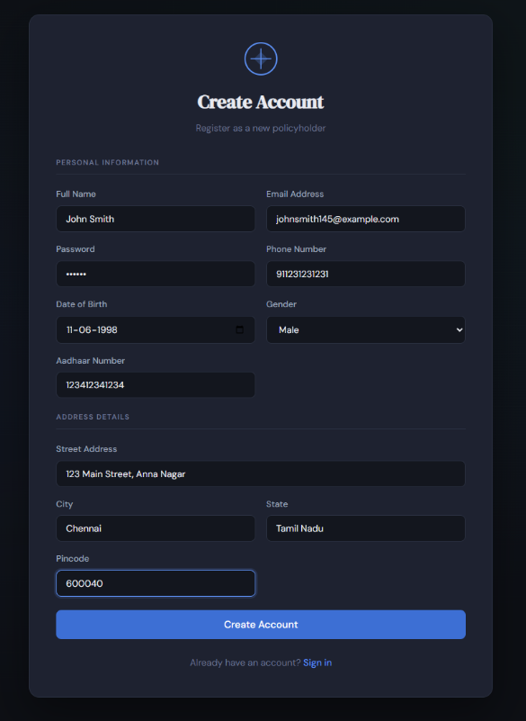
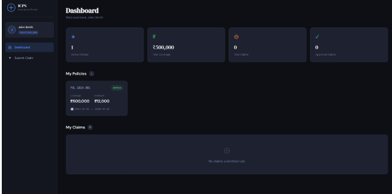
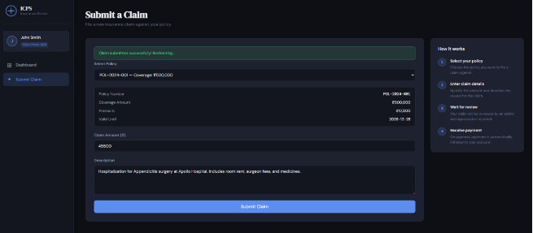
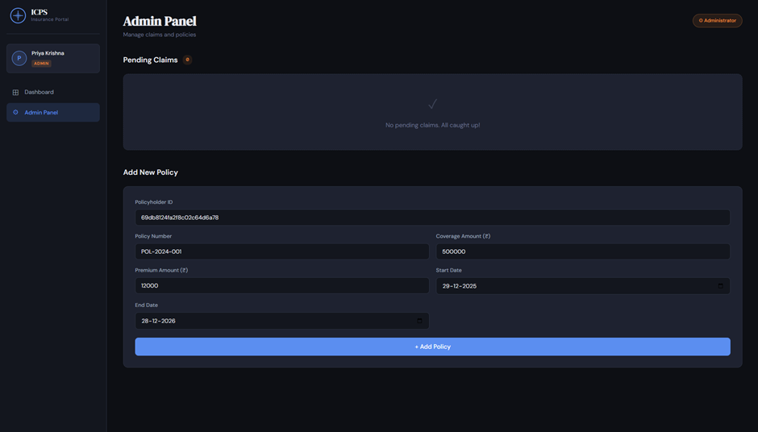
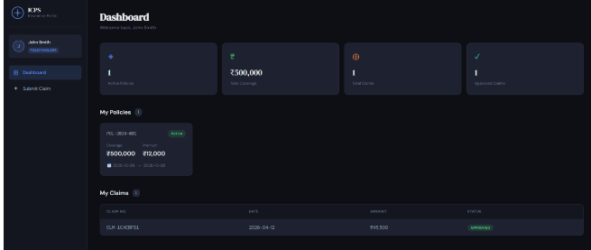

# ICPS — Insurance Claim Processing System

A full-stack microservices application built with Spring Boot, React + TypeScript, and MongoDB, providing secure authentication, policy management, and end‑to‑end insurance claim submission, review, and payment processing.

---

## Architecture

```
┌─────────────────┐     ┌──────────────────────┐     ┌─────────────────┐
│  React Frontend │────▶│  Auth Service :8081   │     │Payment Svc :8083│
│  (Vite + TS)    │     │  DB: authdb           │     │  DB: paymentdb  │
│  Port: 3000     │────▶│──────────────────────-│     └────────▲────────┘
└─────────────────┘     │ Policy-Claim Svc :8082│──────────────┘
                        │  DB: policydb         │  RestTemplate on APPROVE
                        └───────────────────────┘
```

---

## Prerequisites

- Java 17+
- Maven 3.8+
- Node.js 18+
- MongoDB 6+ (running locally on port 27017)

---

## 1. Start MongoDB

```bash
mongod --dbpath /your/data/path
```

MongoDB will auto-create the databases (`authdb`, `policydb`, `paymentdb`) on first write.

---

## 2. Run the Microservices

### Auth Service (Port 8081)
```bash
cd auth-service
mvn spring-boot:run
```

### Policy-Claim Service (Port 8082)
```bash
cd policy-claim-service
mvn spring-boot:run
```

### Payment Service (Port 8083)
```bash
cd payment-service
mvn spring-boot:run
```

---

## 3. Run the Frontend

```bash
cd frontend
npm install
npm run dev
```

Open: http://localhost:3000

---

## API Reference

### Auth Service (8081)

| Method | Endpoint         | Auth     | Description              |
|--------|-----------------|----------|--------------------------|
| POST   | /auth/register  | None     | Register a policyholder  |
| POST   | /auth/login     | None     | Login, returns JWT token |

**Register payload:**
```json
{
  "name": "John Doe",
  "email": "john@example.com",
  "password": "secret123",
  "phone": "9876543210",
  "street": "123 Main St",
  "city": "Mumbai",
  "state": "Maharashtra",
  "pincode": "400001",
  "aadhaarNo": "123456789012",
  "dob": "1990-01-15",
  "gender": "MALE"
}
```

**Login payload:**
```json
{ "email": "john@example.com", "password": "secret123" }
```

**Login response:**
```json
{
  "token": "<JWT>",
  "policyHolderId": "...",
  "name": "John Doe",
  "role": "POLICYHOLDER"
}
```

---

### Policy-Claim Service (8082)

All endpoints require `Authorization: Bearer <token>` header.

| Method | Endpoint                    | Role        | Description                  |
|--------|-----------------------------|-------------|------------------------------|
| GET    | /policies/my                | Any         | Get my policies              |
| POST   | /policies/add               | ADMIN       | Add a policy for a holder    |
| POST   | /claims/submit              | POLICYHOLDER| Submit a new claim           |
| GET    | /claims/my                  | Any         | Get my claims                |
| GET    | /claims/pending             | ADMIN       | Get all PENDING claims       |
| PATCH  | /claims/{claimId}/status    | ADMIN       | Approve or reject a claim    |

**Add Policy (ADMIN):**
```json
{
  "policyHolderId": "<id>",
  "policyNumber": "POL-2024-001",
  "coverageAmount": 500000,
  "premiumAmount": 12000,
  "startDate": "2024-01-01",
  "endDate": "2025-01-01"
}
```

**Submit Claim:**
```json
{
  "policyId": "<id>",
  "claimAmount": 50000,
  "description": "Hospitalization claim"
}
```

**Update Status (ADMIN):**
```json
{ "claimStatus": "APPROVED" }
```
> When APPROVED, the Policy-Claim Service automatically calls the Payment Service via RestTemplate to create a payment record.

---

### Payment Service (8083)

| Method | Endpoint                  | Description                      |
|--------|--------------------------|----------------------------------|
| POST   | /payments/create         | Internal — called by Policy-Claim |
| GET    | /payments/claim/{claimId}| Get payment for a claim          |

---

## Creating an Admin User

Register normally, then update the role directly in MongoDB:

```js
// In mongosh
use authdb
db.policyholders.updateOne(
  { email: "admin@icps.com" },
  { $set: { role: "ADMIN" } }
)
```

---

## JWT Configuration

All three services share the same JWT secret (set in each `application.properties`):

```properties
jwt.secret=icps_super_secret_jwt_key_2024_secure
jwt.expiry=86400000   # 24 hours in ms
```

> **Production note:** Use environment variables or a secrets manager instead of hardcoding the secret.

---

## Frontend Pages

| Route          | Access        | Description                            |
|---------------|---------------|----------------------------------------|
| /login        | Public        | Email + password login                 |
| /register     | Public        | Full registration form                 |
| /dashboard    | Authenticated | View policies and claims               |
| /submit-claim | POLICYHOLDER  | Submit a claim against a policy        |
| /admin        | ADMIN only    | Review pending claims, add policies    |

---
## Screenshots
 
### Login Page

 
### Registration Page

 
### Policyholder Dashboard

 
### Submit a Claim

 
### Admin Panel — Review & Approve Claims

 
### Claim Approved → Payment Created

 
---

## Project Structure

```
icps/
├── auth-service/               # Spring Boot — Port 8081
│   └── src/main/java/com/icps/auth/
│       ├── Controller/AuthController.java
│       ├── Service/AuthService.java
│       ├── Repository/PolicyHolderRepository.java
│       ├── Model/PolicyHolder.java
│       ├── Config/{SecurityConfig,JwtUtil}.java
│       └── Filter/JwtFilter.java
│
├── policy-claim-service/       # Spring Boot — Port 8082
│   └── src/main/java/com/icps/policyclaim/
│       ├── Controller/{PolicyController,ClaimController}.java
│       ├── Service/{PolicyService,ClaimService}.java
│       ├── Repository/{PolicyRepository,ClaimRepository}.java
│       ├── Model/{Policy,Claim}.java
│       └── Config/{AppConfig,SecurityConfig,JwtUtil}.java
│
├── payment-service/            # Spring Boot — Port 8083
│   └── src/main/java/com/icps/payment/
│       ├── Controller/PaymentController.java
│       ├── Service/PaymentService.java
│       ├── Repository/PaymentRepository.java
│       ├── Model/Payment.java
│       └── Config/{SecurityConfig,JwtUtil}.java
│
└── frontend/                   # React + TypeScript + Vite
    └── src/
        ├── App.tsx
        ├── axiosInstance.ts
        ├── types.ts
        ├── index.css
        ├── components/{PrivateRoute,AdminRoute,Navbar}.tsx
        └── pages/{Login,Register,Dashboard,SubmitClaim,AdminPanel}.tsx
```


what are the 5-6 most important screenshots that I must add in github readme 
I will attach the doc containing the screenshots make sure you edit the readme for that 
